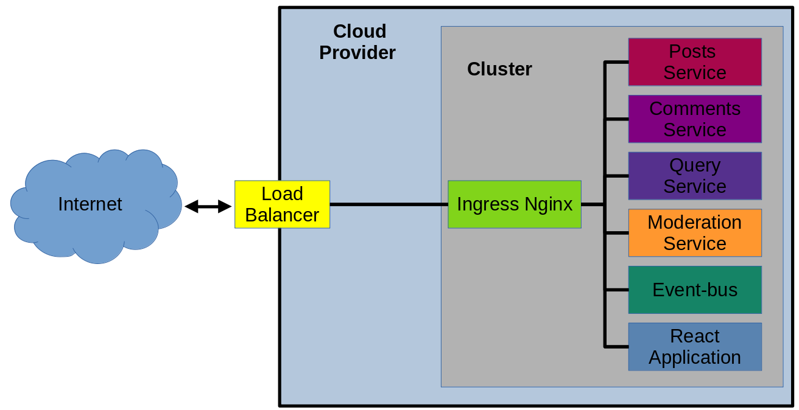

# Mini Microservice Application

This very simple application looks like a blog system where a user can create new posts and others can comment on them.

## Dependences
The following tools are needed to run this project:
- Git
- Docker
- Kubernetes
- Minikube
- Scaffold


## Enabling Ingress Nginx
In this project Ingress Nginx is used to redirect requests from React App to the different services. So, to install this controller follow the instructions below.
### Local development with Minikube Cluster
The ingress controller can be installed through minikube's addons system [^1]:

```bash
~/> minikube addons enable ingress
```

[^1]: Source: https://kubernetes.github.io/ingress-nginx/deploy/#minikube.

# Application/Services Architecture

 


# Running this application

First of all, clone this repository

```bash 
git clone https://github.com/lspaulucio/microservices-course.git
```

Go to the application folder and execute the kubectl apply command

```bash
cd microservices/mini-microservice-boilerplate/blog/
kubectl apply -f infra/k8s
```